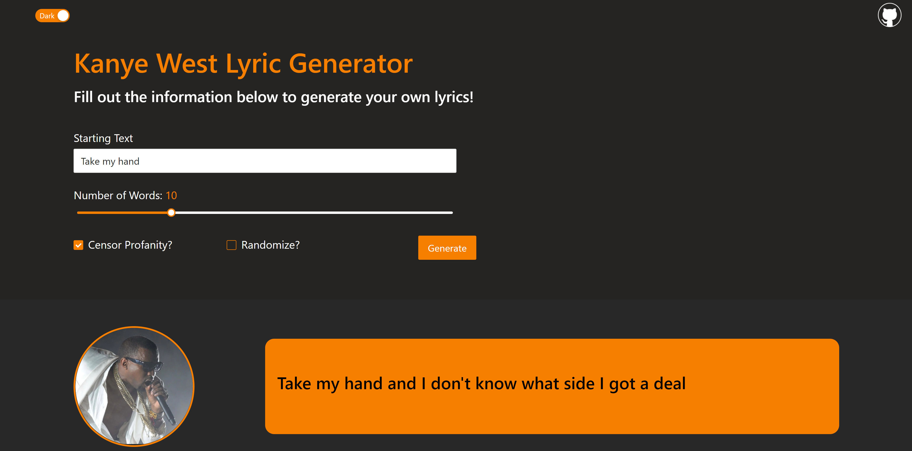

# Kanye Lyric Generator

In this project, I attempt to use Recurrent Neural Networks in `Pytorch` for text generation. Specifically, I take a sample of [Kanye West](https://en.wikipedia.org/wiki/Kanye_West) verses to generate new lyrics! Afterwards, the model was deployed to `Flask` via [Heroku](https://www.heroku.com/about) and connected to a simple `React App`

**Note: The website can be viewed [here](https://kanye-lyric-generator.herokuapp.com/)**



<br />
<br />

## Getting Started

To get this project running on your machine, follow the instructions below

### Jupyter Notebook

To make changes to the Jupyter Notebook, you will need to install [Pytorch](https://pytorch.org). You can find more in-depth instructions on how to do so [here](https://deeplizard.com/learn/video/UWlFM0R_x6I)

Alternatively, you can simply view the results of the Jupyter Notebook [here](https://jovian.ai/nishantbalepur/kanye-lyric-generator) on Jovian, or [here](./Kanye%20Lyric%20Generator.ipynb) in the repository locally

### Flask Web App

Before you are able to run the web server, you will need to install `Python` and `Flask`. Instructions on how to set up `Flask` with `Visual Studio Code` can be found [here](https://code.visualstudio.com/docs/python/tutorial-flask)

Now, run the following command to get the files on your machine

```
git clone https://github.com/nbalepur/Kanye-Song-Generator.git
```

Navigate to `./Kanye-Song-Generator/`, and run the following command:

```
flask run
```

This will open up the website in locally in your default browser

<br />
<br />

## Website User Guide

Navigating the website is very simple! To start generating lyrics, you must first fill out the following fields:

- **Starting Text**: The beginning of the lyric to be generated
- **Number of Words**: The number of additional words to generate
- **Censor Profanity?**: Checkbox to hide/show explicit language
- **Randomize?**: Designates whether the algorithm should select the best fitting word, or a random word from the top 3 best words

After these fields are tuned to your liking, simply press **Generate** to create the new lyric!

<br />

This website also has a light / dark mode switch in the upper-left hand corner!


<br />
<br />

## Website Info

This website was created using the following technologies

- **Jupyter Notebook**: Training the Recurrent Neural Network
  - [Dataset](https://www.kaggle.com/viccalexander/kanyewestverses): Kaggle dataset of Kanye West verses
  - [Pytorch](https://pytorch.org/): Creating the LSTM model
  - [language-check](https://pypi.org/project/language-check/): Grammatical fixes
  - [better-profanity](https://pypi.org/project/better-profanity/): Censoring profanity
  
- **React**: Front-End for the website
  - [Create-React-App](https://github.com/facebook/create-react-app): Intialization of the site
  - [Ant Design](https://ant.design/): Component library for styling
  
- **Flask**: Backend API

- **Heroku**: Website hosting

<br />
<br />

## Acknowledgements

The `Pytorch` background I needed for this project was extremely well-taught form [this data science article](https://www.analyticsvidhya.com/blog/2020/08/build-a-natural-language-generation-nlg-system-using-pytorch/), so thank you for making the information accessibly and easy to follow!

<br />
<br />

## Author Info / Contact

All of the code for this resository was written by me, Nishant Balepur. If you have any questions or concerns, feel free to reach out!

- [GitHub](https://www.github.com/nbalepur)
- [LinkedIn](https://www.linkedin.com/in/nishant-balepur-a03818107/)
- [Email](mailto:balepur2@illinois.edu)
